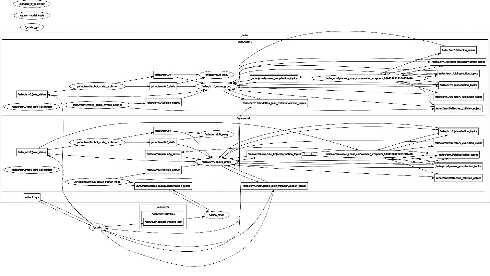

# Project Overview: Robotic Order Fulfillment System

## Introduction
- **Objective**: To modernize the factory order fulfillment process with an automated robotic system.
- **Technologies Employed**: Advanced robotics, ROS (Robot Operating System), intelligent algorithms, and user-centric design principles.
- **Primary Tools**: MOVEIT for robotic motion planning, RViz for visualization, Gazebo for simulation.
- **Skills Demonstrated**: Robotic programming, automated system integration, dynamic path planning, and real-time processing.

## System Description
- **Components**: A fleet of advanced robotic arms and mobile robots optimized for precise and efficient order handling.
- **Operations**:
  - Automated retrieval and packaging of items using robotic arms.
  - Autonomous delivery robots ensuring accurate and timely order delivery.
- **Design Focus**: Enhanced interaction between human operators and robotic systems for streamlined operations.

## ROS Architecture Comprehensive Overview

### Detailed Node Functions
- **Arm1 ROS Node**
  - **Role**: Central processing unit for order management, handling the specifics of order retrieval and prioritization.
  - **Priority-Based Management**: Utilizes a sophisticated priority queue to manage and execute orders based on urgency and importance.
  - **ROS Services**:
    - `AddOrderService`: Enables addition and prioritization of new orders into the system's queue.
    - `GetOrderService`: Provides real-time updates on order status and initiates order execution.
  - **MOVEIT Integration**: Employs MOVEIT for advanced motion planning, ensuring optimal and safe robotic movements.
  - **Inter-node Communication**:
    - Acts as a service client to `Arm2`, facilitating precise object placement based on order priority.

- **Arm2 ROS Node**
  - **Functionality**: Executes actions related to object pickup and placement, directly interacting with the conveyor belt operations.
  - **Services and Actions**:
    - Receives specific action commands from the Object Detector Node to adjust positioning or initiate pickups.
    - Provides a service for determining and communicating the correct placement box based on object priority, enhancing order accuracy.

- **Object Detector Node**
  - **Capabilities**: Detects and classifies objects moving on the conveyor using advanced computer vision techniques.
  - **Data Handling**:
    - Subscribes to `/conveyor/camera1/image_raw` for real-time image processing.
    - Publishes to `image_output` for monitoring and debugging of the detection process.
  - **Role**: Specifies actions for `Arm2` based on object detection and classification results.

### Additional Services and Topics
- **Respawn_objects Service**:
  - Utilized by `Arm1` to manage the respawn of objects on the boxes, ensuring continuous operation without manual resets.
  - `Arm1` sends service requests to the `Spawn_Objects` node, which processes these requests to maintain system readiness and object availability.

- **gripper/control Service**:
  - Allows `Arm1` to manipulate the vacuum gripper for secure object handling during the order fulfillment process.

- **ROS Topics for Visual Feedback and Debugging**:
  - `ariac/arm1/move_group/display_planned_path`: Used by `Arm1` to display the planned motion paths on RViz, providing a visual tool for monitoring and adjusting robotic movements.

## System Limitations and Future Directions
- **Current Shortcomings**:
  - Reduced efficiency with high-speed conveyor operations.
  - Limited capability in detecting and handling multiple objects simultaneously.
- **Proposed Enhancements**:
  - Implement a feedback loop between arms to improve synchronization and error handling.
  - Integrate speed sensors to adapt robotic actions to varying conveyor speeds.

## Additional Resources
- **Project Demonstration Video**: [Watch Here](https://youtu.be/NoscmFj998E)
